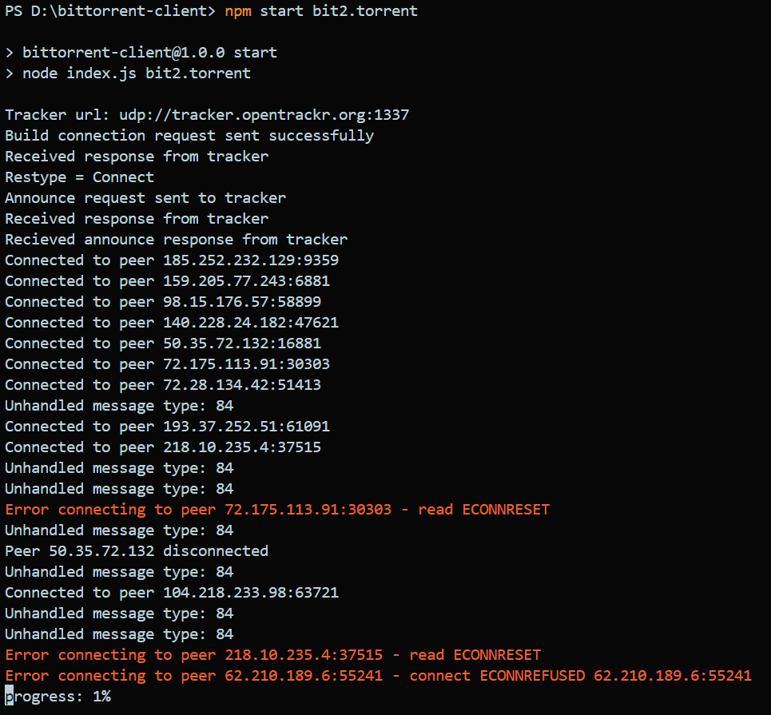

# Node.js BitTorrent Client

This is a BitTorrent client implemented in Node.js. The client can parse `.torrent` files, communicate with trackers, and connect to peers for downloading files.

## Features
- Parses `.torrent` files.
- Communicates with HTTP trackers to fetch peers.
- Manages peer connections (handshakes).
- Downloads file pieces from peers.

## Requirements

- Node.js (v14 or later)
- npm (Node Package Manager)

## Installation

1. Clone the repository:

    ```bash
    git clone https://github.com/your-username/node-bittorrent-client.git
    cd node-bittorrent-client
    ```

2. Install dependencies:

    ```bash
    npm install
    ```

## Usage

1. Place the `.torrent` file you want to download in the project directory or provide its full path in the code.
2. Run the client:

    ```bash
    npm start <path-to-torrent-file>
    ```

## Example




## Roadmap
- [x] Implement peer handshaking.
- [x] Manage piece requests and downloads.
- [x] File assembly and verification.
- [x] Improve error handling and performance.

## Contributing

Contributions are welcome! Please open an issue or submit a pull request if you have suggestions or improvements.

## License

This project is licensed under the MIT License.
